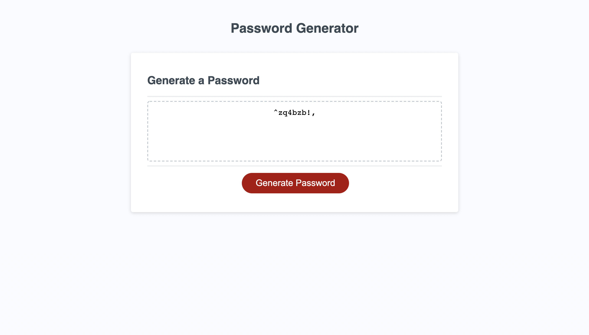

# Password-generator

## About this project

This password generator has the ability to take in the users input, filter out what the user does not desire in their password and create a password according to the amount of characters they wanted in the password. This was achived by a series of functions, each of the fucoused in a specific part of the problem. 

The first function (passwordPromt) displays the promps for the user to choose and validates that the use choices are according to the siderails aswell as storing those choices.

The second function (generatePassword) grabs the users choices and filters out the ones that they do not use. Then it runs it through a loop to fullfill the lenght. Finally it randomizes the password one last time to make sure it is not all together. 

The final function (writePassword) calls the other functions and delivers the final value to the DOM to display it to our user. 

### Above is a screenshot where you can see a password generated by my code with 9 characters lower case letter, symbols and numbers are randomely placed. 

* ['My deployed link'](https://naomi969.github.io/Password-generator/)